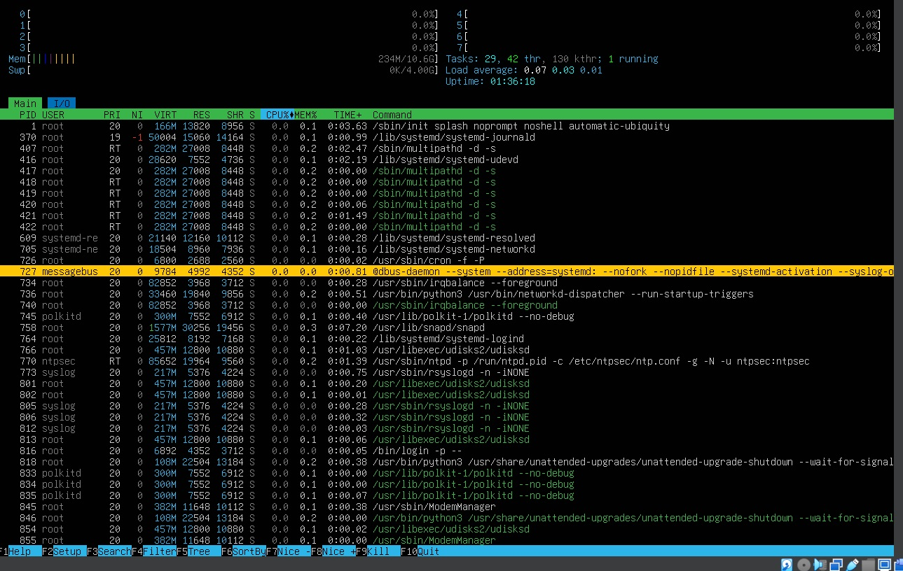

## Part 1
- 
- Вывод текущей версии ОС с помощью команды cat /etc/issue.
## Part 2
- 
- Вызов команды добавления пользователя sudo adduser part2.
- 
- Вывод команды cat /etc/passwd. 
## Part 3
- Название машины задается с помощью команды sudo hostnamectl set-hostname новое_имя (просмотреть текущее имя можно с помощью команды hostnamectl)
- Временная зона задается с помощью команды sudo timedatectl set-timezone Europe/Moscow
- Просмотреть и вывести информацию о сетевых интерфейсах можно несколькими способами 1. ip link show (что является актуальным в последних версия linux) 2. ifconfig -a (что является устаревшим вариантом, который использовался в прошлом). Сетевой интерфейс lo (loopback) это виртуальный сетевой интерфейс, обеспечивает возможность обращения к устройству самому себе(локальный обратный канал). Нужен для: 1. Локальный обмен данными испольщуя стандартный сетевой протокол. Например веб-сервер должен обслуживать запросы поступающие с того же компьютера. 2. Тестирование сетевых служб, так как они могут общаться с самими собой без использования реальных сетевых интерфейсов. 3. Сетевые утилиты ping или localhost используют lo для проверки доступности сетевых служб на том же устройстве. 4. Протокол loopback: Все данные отправленные по интерфейсу lo остаются внутри устройства и не покидают его. Это обеспечивает безопасность и избегает необходимости использования реальной сети.
- "ip addr show" с помощью этой команды можно вывести ip-address с DCHP сервера. DHCP - это Dynamic Host Configuration Protocol. (Динамический, так как позволяет автоматически получить конфигурацию сети, включая ip-address, шлюз по умолчанию и другие настройки без необходимости вручную настраивать каждое устройство) HCP(протокол конфигурации хоста является протоколом который позволяет хостам (компам) получать конфигурацию сети) По факту DHCP протокол который облегчает автоматическое назначение ip-address и других сетевых параметров компьютеров сети
- 
- Вывод внешнего ip-address с помощью команды curl ifconfig.me
- 
- Вывод внутреннего ip-address с помощью команды ip route | grep default | awk '{print $3}'
где ip route - это вывод информации о таблице маршрутизации, grep default ищет строку с совпадением default и awk вытаскивает 3 столбец и печатает его 
- 
- На картинке изображены параметры сетевых параметров. С помощью команды sudo nano /etc/netplan/00-installer-config.yaml я вручную изменил настройки dhcp с помощью программы nano, связка клавиш ctrl + o - сохраняет изменения, ctrl + x - выход из программы.
- 
- Успешно пропингованные 1.1.1.1 и ya.ru с 0% потерь пакетов
- 
- Успешное изменение сетевых статичных настроек 
## Part 4
- 
- На фото изображено отсутствие обновлении sudo do-release upgrade
sudo apt-get dist-upgrade
- 
- На фото изображено отсутствие обновлении sudo apt-get update
sudo apt-get dist-upgrade

## Part 5
- 
- На картинке изображено отображение пользователя созданного в part 2 в группу sudo с помощью команды sudo usermod -aG(-a добавление в группу без удаления из других групп, G список групп через запятую в которые надо добавить юсера) имя_группы имя_пользователя. Команда sudo в операционной системе Linux предоставляет возможность пользователям выполнять команды от имени суперпользователя или других пользователей, обладающих определенными привилегиями, при условии, что они имеют соответствующие права доступа. Назначение sudo заключается в том, чтобы делегировать временные привилегии администратора или других пользователей, чтобы выполнить определенные команды или задачи, которые требуют повышенных привилегий, необходимых для доступа к системным ресурсам или выполнения определенных операций, таких как установка программ, изменение конфигураций системы и т. д.

- Эта возможность становится особенно полезной в сценариях, когда нужно временно получить доступ к привилегированным операциям без необходимости входа в систему под администраторской учетной записью. Вместо того чтобы постоянно работать под учетной записью суперпользователя, что может быть опасно из-за возможности непреднамеренных ошибок или злоумышленных действий, пользователи могут использовать sudo, чтобы получить доступ к необходимым привилегиям только для выполнения конкретных команд.

- Итак, основное назначение команды sudo - это обеспечить безопасное и управляемое выполнение привилегированных команд и задач в операционной системе Linux, предоставляя временный доступ к определенным привилегиям, необходимым для выполнения этих задач.
- 
- На картинке изображено изменение hostname после перезагрузки с помощью команды nano /etc/hosname. Прописав hostname можно увидеть имя текущего hostname

## Part 6
- sudo apt-get install ntp - для установки службы настройки и синхронизации времени, sudo service ntp restart для перезапуска и применения, timedatectl show для проверки статуса. Timedatectl для вывода часового пояса где я нахожусь сейчас.
- 
- На фото изображено корректное время и часовой пояс.
- 
- На фото изображен вывод команды timedatectl show и вывод успешной синхронизации NTPSynchronized=yes.

## Part 7 
- 
- На фото изображено содержимое файла test_vim.txt с использованием блокнота vim. Создание файла происходит с помощью команды vim test_vim.txt. Закрытие файла с помощью комбинации :q!, сохранение и закрытие с помощью :wq, вставка текста с помощью кнопки i. Переключение режима ввода для выхода и сохранения используется комбинация shift + :.
- 
- На фото изображено содержимое файла test_nano.txt с использованием блокнота nano. Создание файла происходит с помощью команды nano test_nano.txt. Сохранение файла с помощью комбинации ctrl + o и ENTER для подтверждения сохранения, закрытие с помощью ctrl + x.
- 
- На фото изображено содержимое файла test_mcedit.txt с использованием блокнота mcedit. Создание файла происходит с помощью команды mcedit test_mcedit.txt. Сохранение файла с помощью кнопки F2 и ENTER для подтверждения сохранения, закрытие с помощью F10.

- 
- На фото изображено содержимое файла test_vim.txt с использованием блокнота vim после редактирования моего никнейма, но без сохранения. Закрытие файла с помощью комбинации :q! без сохранения, сохранение и закрытие с помощью :wq, вставка текста с помощью кнопки i. Переключение режима ввода для выхода и сохранения используется комбинация shift + :.
- 
- На фото изображено содержимое файла test_nano.txt с использованием блокнота nano после редактирования моего никнейма, но без сохранения. Закрытие файла с помощью комбинации ctrl + X без сохранения и ввод N для подтверждения выхода без сохранения.
- 
- На фото изображено содержимое файла test_mcedit.txt с использованием блокнота mcedit после редактирования моего никнейма, но без сохранения. Закрытие файла с помощью нажатия кнопки F10 без сохранения и выбора слова NO для подтверждения выхода без сохранения содержимого файла.

- 
- На фото изображено содержимое файла test_vim.txt с использованием блокнота vim после поиска файла с помощью ввода знака / и последующим вводом необходимого для поиска слова.
- 
- На фото изображено содержимое файла test_vim.txt с использованием блокнота vim после замены слова с помощью команды :s/old/new/g где s - замена во всем файле, old - старое слово, new - новое слово, g - замена во всех вхождениях а не только в первом вхождении. 
- 
- На фото изображено содержимое файла test_nano.txt с использованием блокнота nano для поиска слова в файле, поиск происходит с помощью комбинации ctrl + W (вписываем необходимое для поиска слово), затем снова ctrl + w если хотим поискать в строчке где только нашли это слово. Если хотим пойти с конца файла к курсору то можно прописать комбинацию ctrl + Q. Alt + W после поиска с помощью ctrl + w будет искать следующее вхождение по файлу этого слова при совпадении.
- 
- На фото изображено содержимое файла test_nano.txt с использованием блокнота nano для замены слова необходимо нажать комбинацию клавиш ctrl + \, затем написать слово которое мы хотим заменить, затем enter, затем нужно написать слово которое мы хотим вставить вместо старого, затем enter, после этого программа найдет первое вхождение совпадения и спросит нужно ли заменить это слово будет выбор Y для подтверждения замены и N для отмены замены, A для замены всех вхождений и ctrl + c для отмены замены. Команды на скриншоте нет, так как поиск осуществляется с помощью комбинации клавиш ctrl + \ и не отображается на экране, но после нажатия этих клавиш, выпадает следующее предложение от программы nano, которое мы можем видеть на скриншоте.
- 
- На фото изображено содержимое файла test_mcedit.txt с использованием блокнота mcedit для поиска слова необходимо нажать клавишу F7, затем вписать необходимое для поиска слово, если нужен поиск с чувствительным к регистру необходимо выбрать эту опцию нажав букву e, которая соответствует опции Case sensitive, затем нажать клавишу enter.
- 
- На фото изображено содержимое файла test_mcedit.txt с использованием блокнота mcedit для замены слова необходимо нажать клавишу F4, затем написать искомое слово для замены и в следующей строке написать слово которое нужно вписать, затем выбрать стиль поиска Backwards, Whole words, All charsets. После при нахождении совпадаемого поиска подтвердить замену путем нажатия (R)eplace, A(l)l для всех замен, (S)kip для пропуска вхождения и (C)ancel для отмены

## Part 8 
- Для установки службы sshd необходимо сначало обновить компоненты, sudo apt update, затем sudo apt install openssh-server, затем запустить sudo systemctl start ssh, затем проверить статус sudo systemctl status ssh
- Для активации автостарта sshd с системой необходимо ввести команду sudo systemctl enable ssh, затем проверить включен ли автозапуск с помощью sudo systemctl is-enabled ssh - в ответ получим сообщение enable
- Чтобы перенастроить порт в ssh необходимо ввести команду sudo nano /etc/ssh/sshd_config, затем найти строку Port и изменить её на необходимый нам порт, например 2022, не забудь убрать # чтобы раскоментить строку.
- 
- На фото изображен вывод команды ps -aux | grep sshd с выводом процесса sshd. Команда ps в Ubuntu представляет собой утилиту, которая предоставляет снимок текущих процессов в системе. Она выводит информацию о процессах по умолчанию, включая процесс ID (PID), терминал, использованное время процессора и имя команды. Вывод неотсортирован по умолчанию. Ключи: 
Вот полный список ключей для команды ps:
- grep - вытаскивает строчку по конкретному имени в данном случае sshd.
- a - Показывать процессы всех пользователей, кроме системных.
- u - Показывать процессы, запущенные пользователем.
- x - Показывать процессы, не являющиеся терминальными.
- | - знак разделитель команд.
- перезагрузка производится с помощью команды sudo 
- 
- На фото измененный порт с 22 до 2022. Команда netstat -tan используется для вывода сведений о сетевых соединениях и портах на устройстве. Вот расшифровка значений ключей и столбцов вывода: Значение ключей:
-t : Показывать только TCP-соединения.
-a : Показывать все (активные и неактивные) соединения.
-n : Выводить числовые адреса вместо имен.
Значение каждого столбца вывода:
Proto : Протокол (TCP, UDP и т.д.).
Recv-Q : Длина очереди приема данных для соединения.
Send-Q : Длина очереди отправки данных для соединения.
Local Address : Локальный адрес и порт.
Foreign Address : Внешний адрес и порт.
State : Состояние соединения.
Значение 0.0.0.0:
В столбцах Local Address и Foreign Address значение 0.0.0.0 указывает на то, что соединение ассоциировано с любым доступным сетевым интерфейсом на устройстве. Это означает, что служба или приложение прослушивает все интерфейсы и адреса на устройстве, а также может взаимодействовать с любым внешним адресом и портом.

## Part 9
- 
- Скриншот команды top
- uptime - 18 min.
- количество авторизованных пользователей - 1 user
- общую загрузку системы - load average: 0.20, 0.14, 0.10
- общее количество процессов - 160
- загрузку cpu - 0.0 us, 0.1 sy, 0.0 ni, 99.8 id, 0.0 wa, 0.0 hi, 0.0 si, 0.0 st.
- загрузку памяти - 478.6 used, 591.4 buff / cache.
- pid процесса занимающего больше всего памяти - 1
- pid процесса, занимающего больше всего процессорного времени - 1924

- 
- Сортировка по PID
- 
- Сортировка по PERCENT_CPU
- 
- Сортировка по PERCENT_MEM
- 
- Фильтрация для процесса sshd
- 
- Поиск syslog через функцию search
- 
- Добавленный вывод HOSTNAME, CLOCK, UPTIME

## Part 10
- VBOX HARDDISK
- 200GiB
- 419430400 sectors
- SWAP 4 Gi

## Part 11
- df
- SIZE 101590008
- USED 7951800
- AVAILABLE 88431580
- USE% 9%
- Единица измерения в килобайтах (KB).

- df -Th
- SIZE 97G
- USED 7.6G
- AVAILABLE 85G
- USE% 9%
- Тип файловой системы: ext4

## Part 12
- 
- Вывод команды du
- 
- Вывод du home в байтах
- 
- Вывод команды sudo du -h /home/ 
- Ключ -h означает вывести в человекоудобном читаемом виде.
- 
- Вывод команды sudo du -b /var/ в байтах
- 
- Вывод команды sudo du -h /var/ в человекоудобном читаемом виде.
- 
- Вывод команды sudo du -b /var/log в байтах
- 
- Вывод команды sudo du -h /var/log в человекоудобном читаемом виде.
- 
- Вывод команды sudo du -h /var/log/* в человекоудобном читаемом виде.

## Part 13
- 
- Вывод команды ncdu
- 
- Вывод команды ncdu /home/
- 
- Вывод команды ncdu /var/
- 
- Вывод команды ncdu /var/log

## Part 14
- 2024-03-14, 19:00:00, beastdope, root (uid = 0) by beastdope (uid = 1000)
- 
- На скриншоте изображен успешный перезапуск sshd

## Part 15
- 
- На скриншоте изображено успешное выполнение автоматической задачи uptime каждые 2 минуты
- 
- На скриншоте изображен список текущих заданий для CRON
- 
- На скриншоте изображено отсутствие заданий для CRON путем удаления их командой crontab -r, -l показывает текущие задачи.

